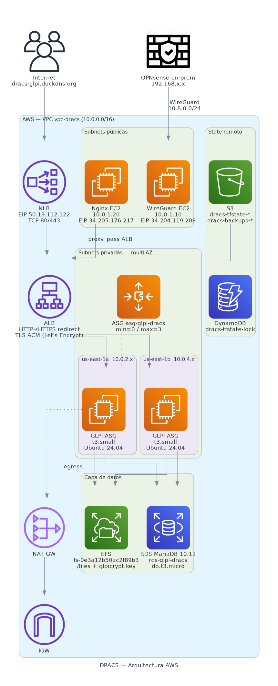

# AWS

En AWS desplegamos la parte cloud de la infraestructura DRACS. Lo que vive aquí es **GLPI** (sistema de ticketing e inventario) servido por un Auto Scaling Group multi-AZ, con la BD en RDS y los ficheros en EFS, accesible desde internet con TLS y también desde la red on-prem a través del túnel WireGuard.

Toda la infraestructura está descrita como código con Terraform y se versiona en el mismo repositorio. La cuenta donde corre todo es del programa AWS Academy (voclabs), por lo que existen limitaciones que han condicionado algunas decisiones.

# 1. Visión general

---

El flujo de tráfico desde internet termina en un NLB con IP fija (a la que apunta DuckDNS) y se delega al ALB, que es quien termina el TLS y reparte entre las instancias GLPI del ASG. Desde on-prem el camino es distinto: el tráfico entra por la VPN WireGuard y puede ir directamente al ALB o pasar por un Nginx interno que sirve de proxy.

```
                         INTERNET
                             │
                    ┌────────┴────────┐
                    │  NLB (EIP fija) │  ← DuckDNS apunta aquí
                    │  TCP:80, TCP:443│
                    └────────┬────────┘
                             │
                    ┌────────┴────────┐
                    │      ALB        │  HTTP:80 → redirect 443
                    │ HTTPS:443 + ACM │  TLS termina aquí
                    └────────┬────────┘
               ┌─────────────┴─────────────┐
        AZ a (us-east-1a)          AZ b (us-east-1b)
     ┌──────────────────┐       ┌──────────────────┐
     │ PRIVATE 10.0.2.x │       │ PRIVATE 10.0.4.x │
     │   GLPI (ASG)     │       │   GLPI (ASG)     │
     └────────┬─────────┘       └─────────┬────────┘
              └────────────┬───────────────┘
                       ┌───┴────┐     ┌──────────┐
                       │  RDS   │     │   EFS    │
                       │MariaDB │     │  /files  │
                       └────────┘     └──────────┘

     PUBLIC 10.0.1.x                PUBLIC 10.0.3.x
  ┌─────────────────────┐       ┌──────────────────┐
  │WireGuard (10.0.1.10)│       │ (sin instancias) │
  │Nginx     (10.0.1.20)│       │                  │
  └─────────────────────┘       └──────────────────┘
            ↕ WireGuard VPN (10.8.0.0/24)
            │
       OPNsense on-prem (192.168.x.x)
```

{width=900px}
<!-- captura del diagrama exportado o screenshot de Resource Map de la VPC en AWS Console -->

# 2. Cuenta AWS

---

La cuenta es del entorno **AWS Academy (voclabs)**. Esto tiene implicaciones concretas en el despliegue:

| Aspecto | Restricción |
| --- | --- |
| Rol IAM | Solo `LabRole` y `LabInstanceProfile` están disponibles; no se pueden crear roles propios |
| Credenciales | Tokens de sesión que rotan cada vez que se reinicia el laboratorio; hay que actualizar el perfil AWS CLI cuando caducan |
| KMS | La key gestionada `aws/ebs` no se puede compartir entre cuentas, hay que crear una CMK propia para migraciones |
| Algunos servicios | Limitados o desactivados (ACM Private CA, Route53 Resolver privado, etc.) |
| Tiempo de sesión | El laboratorio caduca tras X horas; las EC2 y EBS persisten pero las credenciales no |

El key pair en uso es `dracs3` (creado en la cuenta actual; `.pem` en `~/.ssh/dracs3.pem`). El nombre se parametriza vía `var.key_name` en `terraform.tfvars`.

> **Nota:** las claves de WireGuard se mantienen iguales entre cuentas (están en `terraform.tfvars`). Al cambiar de cuenta solo cambia el EIP del gateway, y eso se actualiza en el peer de OPNsense.

# 3. Decisiones de diseño

---

Esta arquitectura no fue la primera. Antes se desplegó una versión **monolítica y de una sola AZ** (código en el folder `simple/` del repo) con todo GLPI en una EC2 standalone, MariaDB local y ficheros en disco. Sirvió para validar rápido la VPN y la autenticación contra el AD. Cuando vimos que íbamos bien de tiempo en el Sprint 3, se rehízo el stack con los patrones que se describen aquí. La documentación de aquella primera versión está en `AWS-HISTORICO-MONOLITICA.md`.

A continuación se justifican las decisiones técnicas más relevantes que diferencian este despliegue de uno trivial.

**ASG en vez de una EC2 fija para GLPI.** Una sola EC2 con GLPI funcionaba en la arquitectura previa, pero acoplaba la BD y los ficheros al disco de la instancia. Si la EC2 caía, había que restaurar desde snapshot. Con ASG las instancias son sustituibles: si una muere, otra arranca con el mismo `user_data` y se conecta a los mismos datos en RDS y EFS.

**RDS y EFS separados del compute.** Sacar la BD a RDS y los ficheros a EFS es lo que permite que el ASG sea efectivamente "stateless". Las dos AZs tienen mount targets propios del EFS y comparten el endpoint RDS.

**NLB + ALB juntos.** El ALB es lo que de verdad enruta y termina TLS, pero su DNS público no tiene IP fija. DuckDNS necesita una IP estática y el NLB sí permite asociar una EIP, así que el NLB hace de "portero" con IP fija y delega al ALB. El target type del NLB es `alb`, una integración nativa para este caso.

**TLS termina en el ALB.** El cert vive en ACM (importado desde certbot, ver `AWS-BALANCEO.md`). El backend trabaja en HTTP plano dentro de la VPC, lo que simplifica la configuración de los target groups.

**AMI Packer con GLPI pre-instalado.** Tras Sprint 4 el Launch Template usa una AMI custom construida con Packer (`packer/glpi.pkr.hcl`) que trae Ubuntu 24.04 + Apache + PHP 8.3 + GLPI 10.0.18 ya instalados. Esto reduce el tiempo de arranque de una instancia nueva de ~10 minutos a ~2 minutos. El `user_data` sigue siendo idempotente: si la AMI ya trae lo que necesita, salta los pasos de descarga e instalación; si se usa Ubuntu vanilla (`var.glpi_ami_id = ""`), instala todo desde cero como fallback. Los datos persistentes (BD y ficheros) siguen viviendo en RDS y EFS, fuera del compute.

# 4. Problemas encontrados

---

Durante el despliegue surgieron varios escollos que dejaron huella en la configuración final.

**KMS por defecto no se puede compartir entre cuentas.** Las primeras AMIs creadas estaban cifradas con la key gestionada `aws/ebs` y no se podían compartir con la cuenta destino. Se creó una CMK (`alias/dracs-glpi-share-key`) con key policy que autoriza a la cuenta destino, y las AMIs se re-cifraron al copiar el snapshot con esa CMK.

**`glpicrypt.key` no estaba en EFS.** La primera migración copió `/var/www/html/glpi/files/` a EFS pero olvidó `/var/www/html/glpi/config/glpicrypt.key`. Sin ese fichero, GLPI no puede descifrar las contraseñas guardadas en BD (LDAP, mail, etc.) y `db:update` aborta. Se lanzó un segundo migrator EC2 que copió la `config/` completa a `_meta/config/` en EFS, y el `user_data` del ASG ahora la restaura en cada arranque.

**GLPI 10.0 hardcodea `public/` en URLs.** El Apache `DocumentRoot` recomendado en la documentación oficial moderna es `/var/www/html/glpi/public`, pero GLPI 10.0.18 sigue generando URLs con prefijo `public/lib/...` en el código. Con DocumentRoot=`/public` esas URLs daban 404. Solución: volver al modo legacy con `DocumentRoot=/var/www/html/glpi` y dejar que las `.htaccess` de las carpetas sensibles bloqueen el acceso.

**Windows Firewall del DC bloqueando LDAP.** Aunque la VPN funcionaba y el ping al DC respondía, las conexiones TCP a 389/636/3268/88/445 estaban filtradas. El firewall de Windows tenía las reglas inbound limitadas a la subnet de la cuenta vieja. Al ampliar el scope a `10.0.0.0/16` las conexiones pasaron.

**SSM agent no toma credenciales nuevas sin reboot.** Al adjuntar `LabInstanceProfile` en caliente a una instancia que ya estaba corriendo, el agente SSM seguía sin credenciales (cache). El workaround estándar es reiniciar la instancia (o sustituirla vía ASG si está en el grupo) para que el agente lea las nuevas credenciales del metadata service.

# 5. Documentación relacionada

---

* G2-A-65 — VPC, subnets en 2 AZs, IGW, NAT y rutas (incluidas las rutas a on-prem via ENI del WireGuard)
* G2-A-60 — EC2 WireGuard (gateway VPN site-to-site) y EC2 Nginx (reverse proxy interno para el tráfico desde on-prem)
* G2-A-67 — NLB, ALB, target groups, listeners y certificado TLS (certbot + ACM + DuckDNS)
* G2-A-66 — Auto Scaling Group + Launch Template, RDS MariaDB y EFS (el backend completo de GLPI)
* G2-A-61 — Security Groups, IAM, KMS y custodia de secretos
* G2-A-63 — estructura del código IaC, variables, state remoto y procedimiento de migración entre cuentas
* G2-A-64 — operativa: SSM, reemplazo de instancia ASG, renovación del cert, escalado y troubleshooting recurrente
* G2-A-62 — la arquitectura previa (monolítica, 1 AZ, GLPI standalone) que se desplegó primero y se sustituyó por la actual
* G2-A-11 — estimación de coste mensual de ambas arquitecturas y comparativa